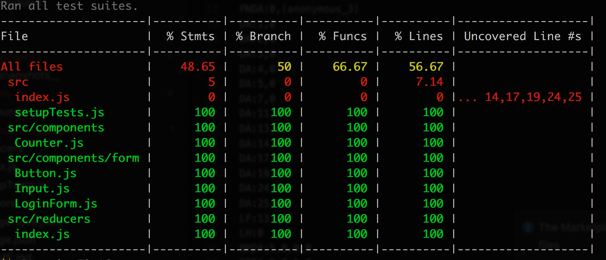

# Testing
## Guideline

1. **Jest, Enzyme介绍**
2. **测试脚本编写**
3. **执行及调试测试**
4. **项目中的测试实践**
5. **回顾**
5. **参考资料**


## 0. Before start

[code base](https://github.com/jungleli/workshop-test)

vscode plugin (jest)

Q:

前端测试测什么？


## 1. Jest , Enzyme

### Jest

🃏 Delightful JavaScript Testing

> Jest is used by Facebook to test all JavaScript code including React applications	

react友好、snapshot、自带断言库、自带Mock库、test runner、report

*[Test React Apps](https://facebook.github.io/jest/docs/en/tutorial-react.html)*

- #### 常用方法

  - Methods
    - beforeEach  /  beforeAll
    - afterEach  /  afterAll
    - describe  /  describe.skip
    - test  /  test.skip


  - asserts
    - expect
    - .toBe(value)
    - .toEqual(value)
    - .toContain(item)
    - .toMatch(regexOrString)
    - .toMatchSnapshot()
    - .toHaveBeenCalled()
    -  [more asserts](https://facebook.github.io/jest/docs/en/expect.html#methods)
  - mock a function
    -  `jest.fn()`
    - `mockFn.mockReturnValue(value)`
    - `mockFn.mockImplementation(fn)`
    - `jest.disableAutomock()`
    - [more](https://facebook.github.io/jest/docs/en/mock-functions.html#mock-property)


### Enzyme

> Enzyme 是一个 React 的 JavaScript 测试工具，能够让断言、操作以及遍历你的 React 组件的输出变得更简单。

*[react test utils](https://reactjs.org/docs/test-utils.html)*， *[jsdom](https://github.com/jsdom/jsdom)*，*[cheerio](https://github.com/cheeriojs/cheerio)*

Render 方法：

1. Shallow Rendering

2. Full DOM Rendering

3. Static Rendering

   ####1.  Shallow Rendering

   只渲染当前组件，不关心子组件的渲染。这是比较推荐的一种render方法，只测试当前组件，减少组件间的依赖。

   example

   ```
   const ButtonWithIcon = ({icon, children}) => (
       <button><Icon icon={icon} />{children}</button>
   );
   ```

   渲染到页面的结果

   ```
   <button>
       <i class="icon icon_coffee"></i>
       Hello Jest!
   </button>
   ```

   shallow render的结果：

   ```
   <button>
       <Icon icon="coffee" />
       Hello Jest!
   </button>
   ```

   子组件Icon未被渲染

   ​

   #### 2. Render （Static Rendering）

   render方法的输出是静态HTLM结构，enzyme使用第三方HTML解析库[Cheerio](https://github.com/cheeriojs/cheerio)完成渲染，渲染返回的是[Cheerio](https://github.com/cheeriojs/cheerio)对象。

   (坑点：大部分enzyme API 不可使用）

   #### 3. Mount （Full DOM Rendering）

   连同子组件一起渲染，需要提供所有的依赖。mount方法依赖DOM，可以使用jsdom库，来模拟浏览器环境。应用场景：可以测试存在dom交互行为的组件以及有life cycle的组件。比如click事件，或者state状态的改变。

   注意：

   - mount方法，实际上会将组件挂载到DOM中，这意味着在同一个父节点下的组件间的测试可能会相互影响。 在一个测试结束后，可以使用.unmount()清理。
   - jsdom本质上是一个完全在 JavaScript 中实现的 headless 浏览器。

   ​

   ​

#### 常用方法

- simulate 模拟事件， 比如onClick, onChange

- html 返回render后的html

- state  获取组件state对象

- props 获取组件props

- update  强行re-render，可以模拟由外部事件引起的组件state变化

- mount/unmount 模拟组件life cycle，componentWillMount/componentWillUnmount

  ​

  #### Selectors (查找DOM)

  **用法：** `.find(selector)`

- class(.foo, .foo-bar), element(div, button),id(#foo), attribute([href="foo"])

- props

  ```
  const wrapper = mount((
    <div>
      <span foo={3} bar={false} title="baz" />
    </div>
  ));

  wrapper.find('[foo=3]');
  wrapper.find('[bar=false]');
  wrapper.find('[title="baz"]');
  ```

  [more selectors](http://airbnb.io/enzyme/docs/api/selector.html)


## 2. Write your tests

Open counter folder，follow the README to start write your tests.

- #### UI 测试

  - #### 组件渲染

  - #### Props

  - #### 事件响应


- #### Reducer测试

  ``` 
  test("should handle INCREMENT action", () => {
        expect(counter(1, { type: "INCREMENT" })).toBe(2);
      });
  ```

  ​

  参考：[Reducer Tests](https://cn.redux.js.org/docs/recipes/WritingTests.html)


## 3.  Jest Cli — Run tests

1. #### Run all tests 

   - `jest`
   - VS Code （Plugin： Jest）


2. #### Run single test

   - 模糊匹配测试文件名和路径`jest fileName or Path`  

3. #### Debuge Tests

4. #### Update snapshot

   - `jest -u`

5. #### Test coverage

   测试覆盖率工具Istanbul*

```
jest --coverage
```

- coverage folder

- coverage report

  

  ​

  ​


## 4. Test conventions in our project

1. #### NGBE

   - Folder
     - `Web.JasmineTests/Components`,` Web.JasmineTests/dataStore`,
   - Naming
     - `XXXTest.js`

2. #### MMB

   - Folder
     - `__test__`

   - Naming
     - Files with `.test.js` suffix.

   - JCL
     - 测试代码和源代码放在一个文件夹下，就近原则
     - 文件名以`.test.js`结尾

   - Coverage
     - Component （basic UI)
     - Datastore (90%+)
     - Utils (90%+)


## 5. 回顾

- Why Jest： 配置简单、react友好、支持DOM API、并行执行测试用例、snapshot、自带断言库、内置reprot、自动mock ES modules、好用的CLI，
- 前端测试关注点
- 生成的snapshot也是项目代码一部分，需要被正确的提交和review
- Snapshot中不能依赖不确定的代码
  - 比如 Date.now(), 遇到返回不确定值得代码需要mock ```Date.now = jest.fn(() => 1482363367071);``` 
- Snapshot测试命名要表意 
- test-driven with snapshot?

## 6. 参考资料

1. [Jest](https://facebook.github.io/jest/docs/en/getting-started.html)
2. [Enzyme API](http://airbnb.io/enzyme/docs/api/)
3. [Jest Configure](https://facebook.github.io/jest/docs/en/configuration.html)
4. [Reducer Tests](https://cn.redux.js.org/docs/recipes/WritingTests.html)

   ​